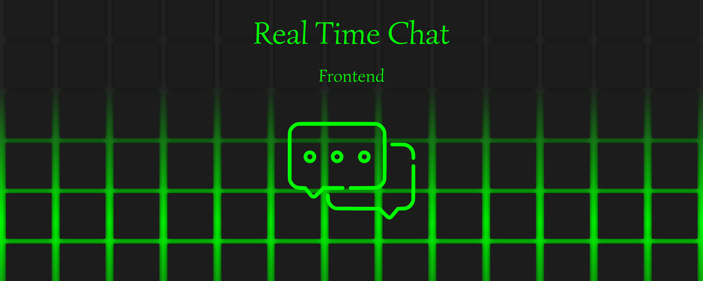

## Index

1. [Index](#index)
2. [Description](#description)
3. [Features](#features)
4. [Technologies used](#technologies-used)
5. [Installation](#installation)
6. [Configuration](#configuration)

## Description

This is the frontend for a real-time chat application built with Vite and React. The application enables instant messaging between users by connecting to a backend via WebSockets. The frontend is optimized for speed and ease of development using Vite, while React handles the UI.

## Features
- Real-time messaging with WebSockets
- Responsive and interactive user interface
- Authentication and user management
- Message notifications
